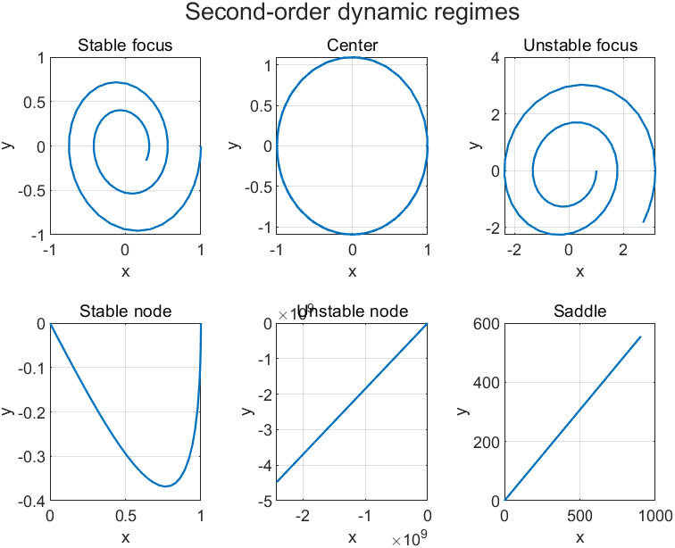
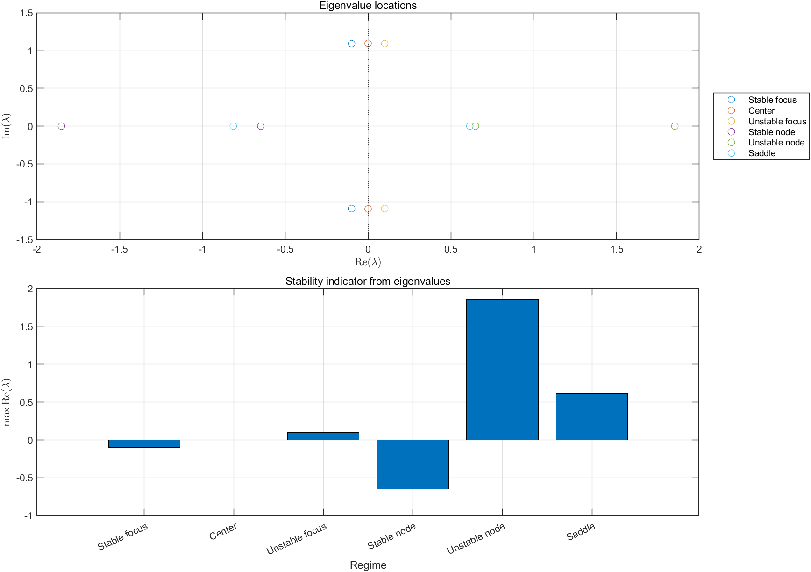
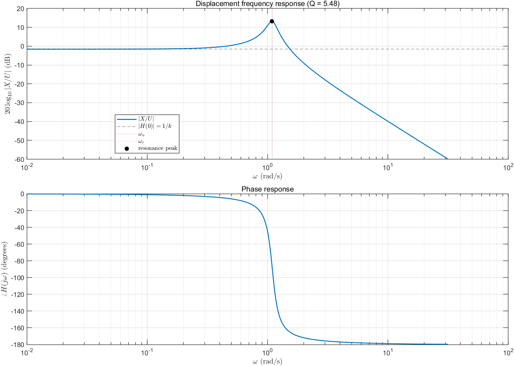
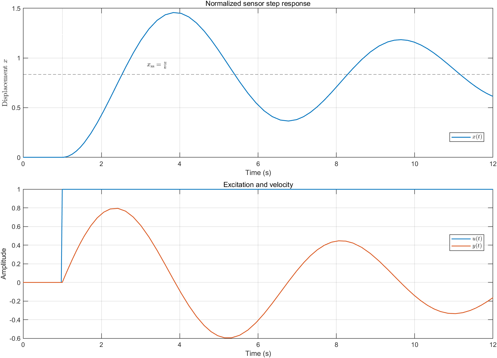
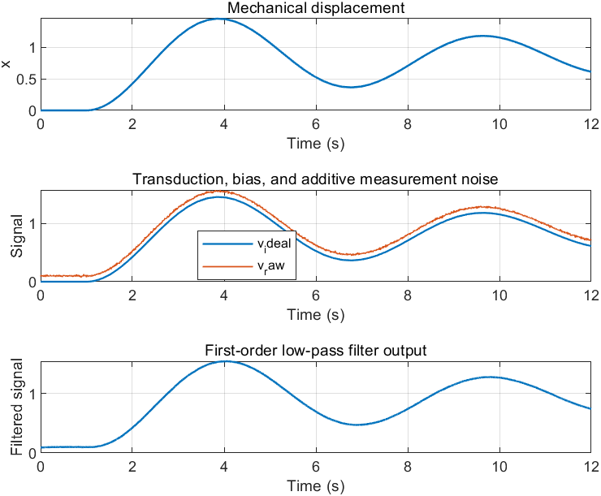
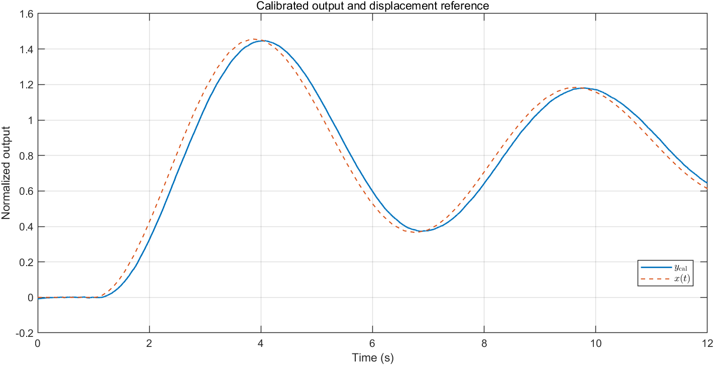
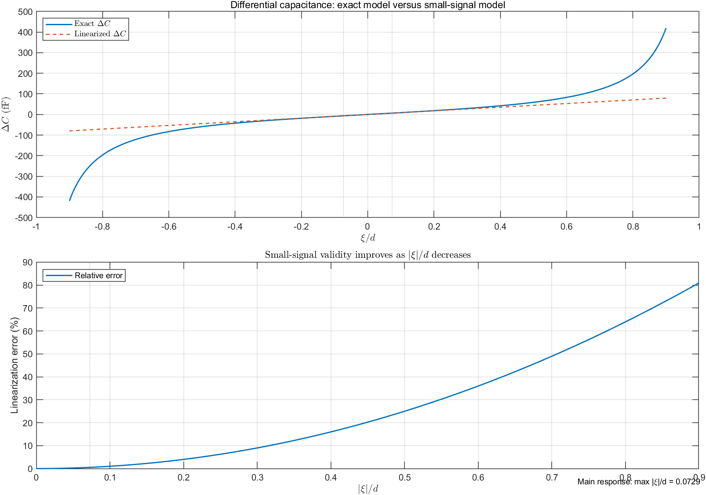
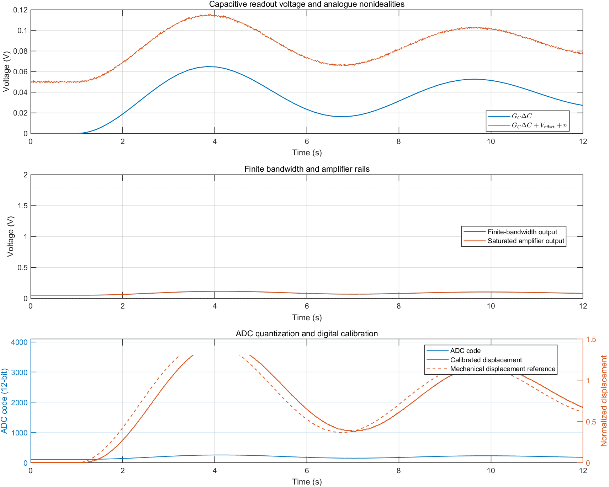
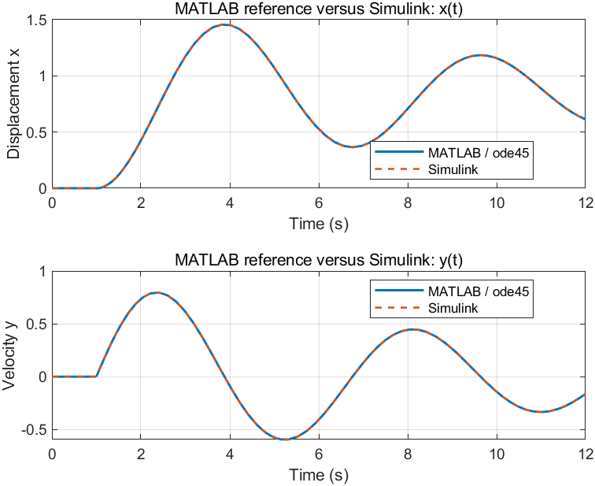

# Methods

This document describes the mathematical model, its MATLAB/Simulink/Python implementations, the signal chain, the dynamic-regime experiments, and the cross-validation procedure used in this repository.

## 1. Model scope and notation

The project uses a normalized, lumped-parameter second-order model as an educational proxy for a driven MEMS sensing element. The variables are:

| Symbol | Meaning |
|---|---|
| $x(t)$ | normalized displacement |
| $y(t)$ | normalized velocity, $y=\dot{x}$ |
| $u(t)$ | normalized external input |
| $k$ | normalized stiffness |
| $r$ | normalized damping |

The model is deliberately small enough that the same equations can be inspected in a MATLAB function, a Simulink block diagram, and a SciPy implementation.

## 2. From the physical analogy to the normalized equation

Starting from a linear mass-spring-damper system,

```math
m\ddot{x}+c\dot{x}+k_sx=F_{\mathrm{ext}}(t),
```

divide by the mass $m$:

```math
\ddot{x}+\frac{c}{m}\dot{x}+\frac{k_s}{m}x
=\frac{F_{\mathrm{ext}}(t)}{m}.
```

Define the normalized coefficients and input

```math
r=\frac{c}{m},\qquad
k=\frac{k_s}{m},\qquad
u(t)=\frac{F_{\mathrm{ext}}(t)}{m}.
```

The equation implemented in the repository is therefore

```math
\boxed{\ddot{x}+r\dot{x}+kx=u(t).}
```

This is a linear time-invariant model when $u(t)$ is prescribed independently of the state.

## 3. First-order state-space form

Introduce the state vector

```math
\mathbf{z}(t)=
\left[x(t),\ y(t)\right]^{\mathsf{T}},
\qquad y(t)=\dot{x}(t).
```

The two first-order equations follow directly:

```math
\dot{x}=y,
```

and

```math
\dot{y}=\ddot{x}=u(t)-kx-ry.
```

Thus,

```math
\boxed{
\dot{\mathbf{z}}=A\mathbf{z}+B u(t)
}
```

with

```math
A=\left[0\ \ 1;\ -k\ \ -r\right],
\qquad
B=\left[0;\ 1\right].
```

The Simulink state-space block uses

```math
C=\left[1\ \ 0;\ 0\ \ 1\right],
\qquad
D=\left[0;\ 0\right],
```

so its two outputs are exactly $x(t)$ and $y(t)$.

## 4. Main driven sensor experiment

The main experiment uses

```math
k=1.2,\qquad r=0.2,
```

with initial conditions

```math
x(0)=0,\qquad y(0)=0.
```

The input is a unit step at $t_s=1\ \mathrm{s}$. It is defined explicitly as:

| Time condition | Input value |
|---|---:|
| $t<t_s$ | $u(t)=0$ |
| $t\geq t_s$ | $u(t)=1$ |

At the switching instant $t=t_s$, the model uses the post-step value $u(t_s)=1$.

For a constant input $u_0$ at equilibrium, set both derivatives to zero:

```math
0=y_{\mathrm{ss}},
\qquad
0=u_0-kx_{\mathrm{ss}}-r y_{\mathrm{ss}}.
```

Therefore,

```math
\boxed{x_{\mathrm{ss}}=\frac{u_0}{k}},
\qquad
y_{\mathrm{ss}}=0.
```

For the unit step used here,

```math
x_{\mathrm{ss}}=\frac{1}{1.2}\approx0.8333.
```

The damping is positive but small, so the response is stable and underdamped. It overshoots before approaching the equilibrium value.

## 5. Laplace transform and frequency response

The step response describes how the sensor evolves in time. Frequency-response analysis asks a complementary question: how strongly does the sensor respond to a sinusoidal input at each frequency?

### 5.1 Laplace-domain derivation

Start with the normalized mechanical equation:

```math
\ddot{x}(t)+r\dot{x}(t)+kx(t)=u(t).
```

Let $X(s)$ and $U(s)$ denote the Laplace transforms of $x(t)$ and $u(t)$. The derivative rules are

```math
\mathcal{L}\{\dot{x}(t)\}=sX(s)-x(0),
```

```math
\mathcal{L}\{\ddot{x}(t)\}=s^2X(s)-sx(0)-y(0),
```

where $y(0)=\dot{x}(0)$. Applying the transform gives

```math
s^2X(s)-sx(0)-y(0)+r\left[sX(s)-x(0)\right]+kX(s)=U(s).
```

Collect the terms containing $X(s)$:

```math
\left(s^2+rs+k\right)X(s)
=U(s)+(s+r)x(0)+y(0).
```

For the main sensor experiment, $x(0)=0$ and $y(0)=0$. Therefore,

```math
\left(s^2+rs+k\right)X(s)=U(s).
```

The transfer function from normalized input to displacement is

```math
H_x(s)=\frac{X(s)}{U(s)}=\frac{1}{s^2+rs+k}.
```

This transfer function describes the system dynamics independently of the particular input waveform. The step response and the frequency response are two different ways of interrogating the same $H_x(s)$.

### 5.2 Sinusoidal steady-state response

For a sinusoidal input

```math
u(t)=A\sin(\omega t),
```

the steady-state response is obtained by evaluating the transfer function on the imaginary axis:

```math
H_x(j\omega)=\frac{1}{k-\omega^2+jr\omega}.
```

The complex response contains both amplitude scaling and phase shift. The displacement amplitude is

```math
|H_x(j\omega)|=\frac{1}{\sqrt{\left(k-\omega^2\right)^2+\left(r\omega\right)^2}}.
```

The output amplitude is therefore

```math
|X|=|H_x(j\omega)|A.
```

The phase lag is

```math
\phi(\omega)=\arg H_x(j\omega)
=-\mathrm{atan2}\left(r\omega,\ k-\omega^2\right).
```

The implementation stores this complex quantity directly, then computes `abs(H)` for the magnitude and `angle(H)` for the phase.

### 5.3 Natural frequency, damping ratio, and quality factor

Define the natural angular frequency and damping ratio by

```math
\omega_n=\sqrt{k},
\qquad
\zeta=\frac{r}{2\sqrt{k}}.
```

Then the transfer function can be written in the standard second-order form

```math
H_x(s)=\frac{1}{k}\frac{\omega_n^2}
{s^2+2\zeta\omega_n s+\omega_n^2}.
```

For a lightly damped resonator, the quality factor is approximately

```math
Q=\frac{1}{2\zeta}=\frac{\omega_n}{r}=\frac{\sqrt{k}}{r}.
```

For the current parameters,

```math
\omega_n=\sqrt{1.2}\approx1.0954\ \mathrm{rad/s},
```

```math
\zeta=\frac{0.2}{2\sqrt{1.2}}\approx0.0913,
\qquad
Q\approx5.48.
```

The ordinary frequency corresponding to $\omega_n$ is

```math
f_n=\frac{\omega_n}{2\pi}\approx0.1743\ \mathrm{Hz}.
```

### 5.4 Resonance and bandwidth

When $r>0$ and $\zeta<1/\sqrt{2}$, the magnitude has a finite resonance peak at

```math
\omega_r=\omega_n\sqrt{1-2\zeta^2}
=\sqrt{k-\frac{r^2}{2}}.
```

The corresponding peak magnitude is

```math
|H_x(j\omega_r)|
=\frac{1}{r\sqrt{k-r^2/4}}.
```

The zero-frequency gain is the static displacement gain:

```math
|H_x(0)|=\frac{1}{k}.
```

For light damping, the half-power bandwidth around the resonance is approximately

```math
\Delta\omega\approx r,
```

so that

```math
Q\approx\frac{\omega_n}{\Delta\omega}.
```

This gives the physical interpretation of $Q$: a high-$Q$ resonator stores energy for many cycles, has a narrow resonance peak, and is more selective in frequency. A low-$Q$ resonator loses energy quickly, has a broader and lower peak, and responds over a wider frequency range.

### 5.5 Physical interpretation across frequency

- **Low frequency:** the spring term dominates. The sensor follows the input quasi-statically, so $x\approx u/k$.
- **Near resonance:** inertial and spring effects nearly balance, allowing the oscillation amplitude to build. Damping controls how high the peak becomes.
- **High frequency:** inertia dominates. The displacement magnitude decays approximately as $1/\omega^2$, and the phase approaches $-180^\circ$.
- **Damping:** positive $r$ removes mechanical energy, limits the resonance peak, and widens the response. Negative $r$ represents an active or unstable diagnostic case that injects energy.

The frequency-response implementation in `matlab/frequency_response.m` and `python/sensor_model.py` evaluates these equations directly. `matlab/generate_frequency_response.m` creates the magnitude and phase figure.

## 6. Dynamic-regime classification

For the unforced diagnostic experiments, $u(t)=0$. The eigenvalues are the roots of

```math
\det(\lambda I-A)=0,
```

which gives

```math
\lambda^2+r\lambda+k=0.
```

Equivalently,

```math
\lambda_{1,2}=\frac{-r\pm\sqrt{r^2-4k}}{2}.
```

The discriminant

```math
\Delta=r^2-4k
```

determines whether the eigenvalues are real or complex. Their real parts determine growth or decay:

| Condition | Interpretation |
|---|---|
| $k<0$ | saddle: eigenvalues have opposite signs |
| $k>0$, $\Delta<0$, $r>0$ | stable focus |
| $k>0$, $\Delta<0$, $r=0$ | center / marginal oscillation |
| $k>0$, $\Delta<0$, $r<0$ | unstable focus |
| $k>0$, $\Delta>0$, $r>0$ | stable node |
| $k>0$, $\Delta>0$, $r<0$ | unstable node |

The code in `matlab/get_test_cases.m` computes the eigenvalues numerically and applies this classification. The plotted phase portraits start from

```math
x(0)=1,\qquad y(0)=0,
```

over a diagnostic interval from $0$ to $6\ \mathrm{s}$. These initial conditions are intentionally different from the main sensor experiment so that the trajectories are visible.

The six parameter sets are:

| Regime | $k$ | $r$ |
|---|---:|---:|
| Stable focus | $1.2$ | $0.2$ |
| Center | $1.2$ | $0$ |
| Unstable focus | $1.2$ | $-0.2$ |
| Stable node | $1.2$ | $2.5$ |
| Unstable node | $1.2$ | $-2.5$ |
| Saddle | $-0.5$ | $0.2$ |

These are analysis cases rather than physically calibrated operating points for the sensor.

## 7. MATLAB reference implementation

The MATLAB implementation is split by responsibility:

- `matlab/sensor_dynamics_model.m` contains only the state equations.
- `matlab/reference_model.m` supplies the input and integrates the state with `ode45`.
- `matlab/init_params.m` is the shared source of parameters.
- `matlab/get_test_cases.m` builds the eigenvalue-classification examples.
- `matlab/generate_results.m` creates the figures.
- `matlab/validate_model.m` compares MATLAB with Simulink.
- `matlab/discretize_sensor_model.m` computes fixed-step matrices for the
  code-generation model.
- `matlab/simulate_discrete_model.m` runs the same fixed-step algorithm in
  MATLAB.

The step input is discontinuous at $t_s=1\ \mathrm{s}$. To avoid allowing an adaptive solver step to cross that discontinuity, `reference_model.m` integrates in two intervals:

```math
[0,t_s]\quad\text{and}\quad[t_s,t_f].
```

The final state of the first interval is used as the initial state of the second interval. This preserves state continuity while giving each integration interval a constant input.

## 8. Simulink implementation

`matlab/build_models.m` creates the project models when run locally with
Simulink. The continuous models use the variable-step `ode45` solver; the
separate code-generation model uses a fixed-step discrete solver.

### Mechanical model

The `sensor_dynamics.slx` signal flow is

```text
Step input u(t) -> State-Space block -> Demux -> x(t), y(t)
```

The State-Space block contains the same matrices $A$, $B$, $C$, and $D$ defined above, with initial state

```math
\mathbf{z}(0)=\left[0;\ 0\right].
```

The model uses the variable-step `ode45` solver with relative tolerance $10^{-6}$ and absolute tolerance $10^{-8}$.

### Signal-chain model

The `sensor_signal_chain.slx` model extends the mechanical output with transduction, bias, noise, low-pass filtering, and calibration. The intermediate signals are logged so that each stage can be inspected independently.

The new `sensor_capacitive_chain.slx` variant replaces the abstract transduction gain with explicit blocks for physical displacement, the two electrode gaps, reciprocal operations, electrode capacitances, differential capacitance, and a normalized readout gain. `build_models(params)` creates this additional model when it is absent and leaves existing model files untouched.

### Fixed-step code-generation model

The `sensor_codegen_discrete.slx` model is intentionally separate from the
continuous `sensor_dynamics.slx` reference. Its purpose is to define an
algorithm that can run once per sampling period on a CPU, MCU, or DSP and can
therefore be passed to Simulink Coder.

Let the continuous state vector be

```math
\mathbf{z}(t)=\begin{bmatrix}x(t)\\y(t)\end{bmatrix},
\qquad
\dot{\mathbf{z}}(t)=A\mathbf{z}(t)+B u(t).
```

For a sample time $T_s$, assume that the input is held constant over each
interval $[nT_s,(n+1)T_s)$. The exact zero-order-hold discretisation is

```math
\mathbf{z}[n+1]=A_d\mathbf{z}[n]+B_d u[n],
```

where

```math
A_d=e^{A T_s},
\qquad
B_d=\int_0^{T_s}e^{A\tau}B\,d\tau.
```

The repository computes these matrices offline with the augmented matrix

```math
\exp\left(
\begin{bmatrix}A&B\\0&0\end{bmatrix}T_s
\right)
=
\begin{bmatrix}A_d&B_d\\0&1\end{bmatrix}.
```

The default value is $T_s=0.005\ \mathrm{s}$. The choice is a modelling
decision: a smaller $T_s$ gives more computation per second but represents the
continuous response more closely when a simpler numerical discretisation is
used. Here the exact zero-order-hold matrices make the mechanical state update
particularly accurate for the piecewise-constant step input.

The blocks are:

```text
Step input
    -> Discrete State-Space [Ad, Bd, C = I, D = 0]
    -> x[n], y[n] Outports
```

Unlike the continuous reference, this model has no variable-step solver and no
continuous Integrator or Transfer Fcn states. That makes the timing explicit
and makes the model appropriate for code-generation experiments. The ordinary
Outports are also preferable to `To Workspace` blocks in the algorithm model,
because logging is a simulation concern while the state update is the
deployable computation.

## 9. Signal-chain equations

The signal-chain study keeps the original gain model as a useful baseline and adds a simplified differential capacitive model. This makes the approximation visible instead of silently replacing one model with another.

### Transduction

The original abstract sensor signal is a gain applied directly to normalized displacement:

```math
v_{\mathrm{ideal}}(t)=Gx(t).
```

Here $x$ is dimensionless in the mechanical model. To introduce physical geometry, define the proof-mass displacement

```math
\xi(t)=\alpha_x x(t),
```

where $\alpha_x$ is the displacement scale in metres per normalized unit.

### Differential capacitive transduction

For a symmetric proof mass between two fixed electrodes, let $d$ be the nominal gap, $A$ the electrode area, and $\varepsilon$ the permittivity. The exact parallel-plate capacitances are

```math
C_1(\xi)=\frac{\varepsilon A}{d-\xi}.
```

```math
C_2(\xi)=\frac{\varepsilon A}{d+\xi}.
```

The geometric validity condition is

```math
|\xi|\lt d.
```

The differential and common-mode capacitances are therefore

```math
\Delta C=C_1-C_2
=\frac{2\varepsilon A\xi}{d^2-\xi^2},
```

```math
C_{\Sigma}=C_1+C_2
=\frac{2\varepsilon A d}{d^2-\xi^2}.
```

The differential quantity is odd in displacement: changing the direction of motion changes the sign of $\Delta C$. The common-mode quantity is even: it changes with the magnitude of displacement but not its sign. The condition $|\xi|\lt d$ is a geometric validity condition because the proof mass must not close either electrode gap.

### Small-signal linearization

Around the centred position $\xi=0$, use the first-order expansions

```math
\frac{1}{d-\xi}\approx\frac{1}{d}+\frac{\xi}{d^2},
\qquad
\frac{1}{d+\xi}\approx\frac{1}{d}-\frac{\xi}{d^2}.
```

Subtracting the two expansions gives

```math
\boxed{\Delta C\approx S_C\xi,
\qquad
S_C=\frac{2\varepsilon A}{d^2}.}
```

The exact result also shows the nonlinear correction directly:

```math
\Delta C
=\frac{S_C\xi}{1-(\xi/d)^2}.
```

Thus, the approximation is accurate when $|\xi|/d\ll1$. The relative correction grows as the displacement approaches the gap, which is why the generated capacitive-transduction figure shows both the central small-signal region and the near-gap nonlinear region.

### From capacitance to a readout voltage

A simplified electrical readout can be represented by a gain $G_C$:

```math
v_C=G_C\Delta C.
```

To compare it directly with the old $v=Gx$ path, choose

```math
G_C=\frac{G}{S_C\alpha_x}.
```

Then the linearized capacitive path has exactly the same small-signal gain:

```math
v_{C,\mathrm{linear}}
=G_C S_C\alpha_x x
=Gx.
```

The exact path retains the geometric nonlinearity:

```math
v_{C,\mathrm{exact}}
=\frac{Gx}{1-\left(\alpha_x x/d\right)^2}.
```

In this repository, `signal_chain_reference.m` exposes the abstract, linearized, and exact paths, while the generated capacitive Simulink model implements the exact path with ordinary blocks. The bias, noise, low-pass, and calibration stages then operate on the exact capacitive readout.

### Capacitive readout front-end

The next system-level layer models the interface between the differential
capacitance and a digital output. It is intentionally an ideal circuit model,
not a transistor-level amplifier. The voltage produced by an ideal C--V
converter or charge-amplifier abstraction is

```math
v_{\mathrm{sensor}}=G_C\Delta C.
```

The analogue input to the amplifier includes a static offset and illustrative
noise:

```math
v_{\mathrm{in}}
=v_{\mathrm{sensor}}+V_{\mathrm{offset}}+n(t).
```

Finite amplifier bandwidth is represented by a first-order transfer function

```math
H_{\mathrm{amp}}(s)=\frac{1}{\tau_{\mathrm{amp}}s+1}.
```

The band-limited voltage is then restricted to the amplifier supply rails:

```math
v_{\mathrm{amp}}
=\min\left(\max\left(v_{\mathrm{bandlimited}},V_{\mathrm{min}}\right),
V_{\mathrm{max}}\right).
```

This nested `max`--`min` expression is the saturation operation: it first
prevents the voltage from falling below $V_{\mathrm{min}}$, then prevents it
from exceeding $V_{\mathrm{max}}$.

For an $N$-bit ADC with input range $[V_{\mathrm{ADC,min}},V_{\mathrm{ADC,max}}]$,
the ideal quantization step is

```math
q_{\mathrm{ADC}}
=\frac{V_{\mathrm{ADC,max}}-V_{\mathrm{ADC,min}}}{2^N-1}.
```

The digital code is obtained by clipping the amplifier voltage to the ADC
range and rounding to the nearest code. The reconstructed voltage is used for
digital calibration:

```math
\widehat{\Delta C}
=\frac{v_{\mathrm{ADC}}-\widehat{V}_{\mathrm{offset}}}{G_C},
```

```math
\widehat{x}
=\frac{\widehat{\Delta C}}{S_C\alpha_x}.
```

This chain makes the mechanical-to-electrical design trade-off explicit. A
larger gap $d$ reduces the capacitance sensitivity $S_C$, so the front-end
needs more voltage gain or a lower-noise input. A higher mechanical $Q$ raises
the displacement near resonance and may improve detectability, but it can
also increase the required amplifier linear range. The amplifier bandwidth
must cover the mechanical signal of interest, the noise floor must be small
relative to $G_C\Delta C$, and the ADC range and resolution must capture the
calibrated signal without excessive clipping or quantization error.

The MATLAB implementation is `readout_frontend_reference.m`; the generated
`sensor_readout_frontend.slx` model maps the same stages to Simulink blocks.

### Bias and measurement noise

After transduction, the raw measurement is

```math
v_{\mathrm{raw}}(t)=v_C(t)+b+n(t),
```

where $b$ is a fixed bias and $n(t)$ is zero-mean illustrative noise. The random seed is fixed so that the plotted example is reproducible; it is not a device noise specification.

### First-order low-pass filter

The Simulink signal-chain model uses the continuous transfer function

```math
H(s)=\frac{1}{\tau s+1}.
```

For the MATLAB reference plot, the filter is evaluated on a uniform time grid using the update

```math
\alpha_n=\frac{\Delta t_n}{\tau+\Delta t_n},
```

```math
v_{\mathrm{filtered}}[n]
=v_{\mathrm{filtered}}[n-1]
+\alpha_n\left(v_{\mathrm{raw}}[n]-v_{\mathrm{filtered}}[n-1]\right).
```

This is a transparent discrete approximation used for the illustrative signal-chain figure. The primary MATLAB/Simulink numerical validation concerns the mechanical states $x(t)$ and $y(t)$.

### Bias compensation and calibration

The final output is

```math
y_{\mathrm{cal}}(t)
=S\left(v_{\mathrm{filtered}}(t)-\hat{b}\right),
```

where $\hat{b}$ is the estimated bias and $S$ is the calibration scale.

## 10. Python/SciPy implementation

`python/sensor_model.py` implements the same state equation without requiring MATLAB or Simulink. It uses SciPy's ODE tools for numerical integration and exposes the state-space and regime-classification logic used by the Python tests.

`python/capacitive_transduction.py` implements the exact capacitance equations and the small-signal approximation independently of MATLAB. It returns both electrode capacitances, differential capacitance, common-mode capacitance, and the analytical sensitivity $S_C$.

`python/readout_frontend.py` implements the ideal voltage front-end, finite
bandwidth, saturation, ADC quantization, and digital displacement calibration
without requiring a MATLAB license.

`python/discrete_sensor_model.py` mirrors the fixed-step Simulink model. It
computes $A_d$ and $B_d$ once with SciPy and then applies the matrix update for
each sample. The per-sample operation contains no numerical integration or
matrix-exponential calculation; those are offline preparation steps.

The tests in `tests/python/test_sensor_model.py` check properties rather than only example numbers:

- the input-driven state equation;
- the original unforced case $u(t)=0$;
- the expected constant-input equilibrium;
- energy conservation when $r=0$;
- energy decay when $r>0$;
- eigenvalue-based regime classification;
- zero-output, symmetry, small-signal, and gap-validity properties of the capacitive transducer;
- rail, ADC-range, and small-signal calibration properties of the readout front-end.
- zero-order-hold equilibrium, deterministic state updates, and agreement
  between the fixed-step and continuous reference models.

## 11. Discrete-time validation and C++ generation

`generate_discrete_results.m` samples the high-accuracy `ode45` trajectory on
the fixed-step grid and compares it with `simulate_discrete_model.m`. It
reports maximum absolute and RMS errors for both $x$ and $y$ and creates
`results/discrete_vs_continuous.png`.

The expected workflow is:

```matlab
addpath('matlab');
params = init_params();
build_models(params);
report = generate_discrete_results(params);
```

The same discrete algorithm can then be exported as C++ source with the
Simulink Coder app/product:

```matlab
generate_cpp_code(params);
```

This selects C++ as the target language and generates source only for the
fixed-step model. Compiling a host executable is a separate compiler step.
Simulink Coder must be installed and licensed; a standard Simulink installation
alone cannot perform this export.
The generated files are local build artifacts, so the repository keeps the
model, the offline discretisation code, and the validation tests rather than
the generated build directory.

Generated C++ is an implementation of the model algorithm for a host CPU,
MCU, or DSP. It is not ASIC RTL. A future hardware-design stage would need a
separate HDL/RTL workflow and fixed-point design decisions.

## 12. MATLAB--Simulink cross-validation

`validate_model.m` obtains the MATLAB reference trajectory and the logged Simulink trajectories. Because the two variable-step solvers generally return different time grids, both trajectories are linearly interpolated onto a common vector

```math
t_1,t_2,\ldots,t_N.
```

For each state, the pointwise errors are

```math
e_x(t_i)=x_{\mathrm{MATLAB}}(t_i)-x_{\mathrm{Simulink}}(t_i),
```

```math
e_y(t_i)=y_{\mathrm{MATLAB}}(t_i)-y_{\mathrm{Simulink}}(t_i).
```

The reported maximum absolute and root-mean-square errors are

```math
E_{\infty,x}=\max_i|e_x(t_i)|,
\qquad
E_{\mathrm{RMS},x}
=\sqrt{\frac{1}{N}\sum_{i=1}^{N}e_x(t_i)^2},
```

with the same definitions for $y$. These metrics quantify agreement between two numerical implementations; they are not physical measurement uncertainty.

Small nonzero values are expected because the solvers use adaptive internal time steps and the comparison applies interpolation. The generated comparison figure records the actual values from the local MATLAB/Simulink run rather than embedding assumed results in the repository.

## 13. Reading the generated results

The following figures are generated by `matlab/generate_results.m` after running the local MATLAB/Simulink workflow.

### Phase portraits



The horizontal axis is displacement $x$ and the vertical axis is velocity $y$. The stable focus spirals inward, the center remains on a closed orbit, and the unstable focus spirals outward. The stable node approaches the origin without sustained rotation, the unstable node grows away from the origin, and the saddle shows the characteristic stable and unstable directions.

### Eigenvalues and stability indicator



The upper plot places the eigenvalues in the complex plane. The lower plot shows $\mathrm{max}\,\mathrm{Re}(\lambda)$ for each regime: negative values indicate decay, zero indicates marginal behavior, and positive values indicate instability.

### Frequency response



The magnitude plot shows the static low-frequency gain, the resonant amplification near $\omega_n$, and the high-frequency roll-off. The phase moves from approximately $0^\circ$ at low frequency toward $-180^\circ$ at high frequency. The resonance peak and its width are controlled primarily by the damping ratio and $Q$ factor.

### Driven sensor response



The unit input begins at $t=1\ \mathrm{s}$. The displacement overshoots because the damping is light, while the velocity oscillates around zero and decays. The dashed horizontal line marks the equilibrium value $x_{\mathrm{ss}}=u/k$.

### Signal-chain stages



The first panel is the mechanical displacement. The second panel shows the ideal transduced signal and the raw signal after adding the configured bias and deterministic illustrative noise. The third panel shows the smoothed first-order low-pass output.

### Calibrated output



The calibrated output follows the displacement reference but has a small transient lag introduced by the low-pass filter. The bias compensation removes the configured static bias estimate.

### Differential capacitive transduction



The upper panel compares the exact parallel-plate difference $\Delta C$ with its first-order approximation. The dotted markers show the maximum normalized displacement reached by the main step experiment. The lower panel makes the approximation error explicit as a function of $|\xi|/d$: the error is negligible near the centred operating point and increases rapidly as the proof mass approaches an electrode.

### Capacitive readout front-end



The first panel shows the ideal voltage generated from $\Delta C$ together with
offset and illustrative amplifier noise. The second panel shows the effect of
finite bandwidth and the amplifier rails. The final panel shows the quantized
ADC code and the digitally calibrated displacement compared with the
mechanical reference. This figure is a system-level study of front-end
requirements, not a transistor-level circuit simulation.

### MATLAB and Simulink comparison



The solid and dashed curves are visually almost coincident for both mechanical states. The subplot titles report the maximum absolute and RMS differences measured during the local run.

## 14. Reproducibility and CI

The canonical Python environment is defined in `environment.yml`. GitHub Actions creates that environment and runs the Python test suite on pushes and pull requests. The MATLAB/Simulink workflow is manual because it requires MATLAB and Simulink on the runner.

The figure-generation workflow is:

```matlab
addpath('matlab');
params = init_params();
build_models(params);
generate_results(params);
```

The generated `.slx` models and `.png` figures are local artifacts produced by that workflow. Simulink build folders such as `slprj/` are ignored by Git.

## 15. Limitations

The capacitive branch is still an educational lumped model: it does not represent fringing fields, electrostatic force feedback, pull-in dynamics, parasitic capacitance, a charge amplifier, switched-capacitor readout, packaging, temperature dependence, manufacturing variation, or a qualified noise density. The MEMS label indicates the modelling context and signal-chain motivation; the implemented mechanical equations remain a normalized educational second-order system.
