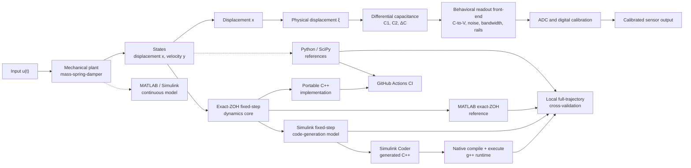

# Simplified MEMS Sensor Dynamics

**A cross-tool implementation and verification of a simplified MEMS-inspired dynamical sensor model using MATLAB/Simulink and Python/SciPy.**

This repository develops one normalized, lumped-parameter mass-spring-damper model across several representations. It combines state-space analysis, Simulink block diagrams, a license-free Python reference implementation, signal-chain modelling, physics-aware tests, and continuous integration.

The model is educational and intentionally simplified. It is not a calibrated multiphysics model of a commercial MEMS device.

## Model at a glance

The mechanical dynamics are

```math
\dot{x}=y,\qquad \dot{y}=u(t)-kx-ry.
```

The main demonstration uses a unit step input, zero initial conditions, $k=1.2$, and $r=0.2$. The detailed derivation, implementation mapping, and figure interpretation are in [METHODS.md](METHODS.md).

The signal-chain study now includes a symmetric differential-capacitive transducer. It compares the exact geometry-dependent capacitance with the small-signal approximation that reduces to the original $v=Gx$ model near the centred position.

The next readout layer models an ideal C--V/charge-amplifier interface with offset, noise, finite bandwidth, saturation, ADC quantization, and digital calibration.

## Architecture at a glance

The repository follows one simplified sensor model from physics to software
verification:



The upper branch is the complete system-level sensor chain. The lower branch
is the fixed-step mechanical dynamics core used for code generation and
runtime verification. The local path validates the actual C++ produced by
Simulink Coder against the fixed-step Simulink model, MATLAB exact-ZOH
reference, and Python/SciPy. GitHub Actions uses the tracked portable C++
implementation because the Simulink-generated source requires a licensed
MATLAB/Simulink toolchain.

## What is included

- MATLAB reference dynamics and automatically generated Simulink models.
- Laplace-domain and frequency-response analysis of the normalized resonator.
- Six eigenvalue-based regimes: stable/unstable focus, center, stable/unstable node, and saddle.
- A transparent signal chain with transduction, bias, deterministic illustrative noise, low-pass filtering, and calibration.
- A simplified differential-capacitive transducer with exact and linearized readout paths.
- An ideal capacitive readout front-end with ADC and digital calibration.
- Python/SciPy equations and physics-aware `pytest` tests; see the detailed
  [Python component guide](python/README.md).
- A separate fixed-step discrete model for code-generation experiments and
  continuous-versus-discrete validation.
- A local generated-C++ runtime harness cross-validated against MATLAB,
  Simulink, and SciPy at the fixed-step sample grid.
- A portable C++ fixed-step runtime compiled and checked by GitHub Actions
  against the Python/SciPy reference.
- Conda environment definition and GitHub Actions CI.
- Optional manual MATLAB/Simulink CI for licensed runners.

## Results

The figures in `results/` are generated locally by MATLAB:

- [Phase portraits](results/phase_portraits.png)
- [Eigenvalue and stability overview](results/damping_regimes.png)
- [Sensor step response](results/sensor_step_response.png)
- [Signal-chain stages](results/signal_chain.png)
- [Calibrated output](results/calibrated_output.png)
- [Frequency response](results/frequency_response.png)
- [Exact versus linearized capacitive transduction](results/capacitive_transduction.png)
- [Capacitive readout front-end](results/readout_frontend.png)
- [MATLAB versus Simulink](results/matlab_vs_simulink.png)
- [Continuous versus discrete model](results/discrete_vs_continuous.png)

## Quick start

From the repository root in MATLAB:

```matlab
run_demo
```

Or run the stages explicitly:

```matlab
addpath('matlab');
params = init_params();
build_models(params);
generate_results(params);
generate_discrete_results(params);
```

This creates the additional capacitive, readout, and fixed-step code-generation
models when they are not already present. Existing Simulink files are kept
unchanged. The fixed-step comparison is written to
`results/discrete_vs_continuous.png`.

The optional C++ source generation requires the **Simulink Coder app/product**
to be installed and licensed; Simulink alone is not sufficient. In MATLAB,
open the **Apps** tab and launch **Simulink Coder**, or run the reproducible
script below:

```matlab
addpath('matlab');
params = init_params();
generate_cpp_code(params);
```

Generated source and build folders are local artifacts and are not uploaded by
the repository workflow. Compiling the generated source into a host executable
is a separate compiler/toolchain step.

### Full local C++/Simulink/Python comparison

The complete generated-code comparison requires MATLAB/Simulink,
**Simulink Coder**, a C++ compiler such as `g++`, and the Conda environment
defined by `environment.yml`. The generated source is intentionally not stored
in Git, so another user must regenerate it locally.

First generate the fixed-step C++ source in MATLAB:

```matlab
addpath('matlab');
params = init_params();
build_models(params);
output_folder = generate_cpp_code(params);
```

`output_folder` is the machine-specific code-generation directory. In the
default local layout it is `sensor_codegen_discrete_grt_rtw/`. From Git Bash,
compile the local harness together with the two generated model source files:

```bash
cd /path/to/mems-sensor-dynamics
CODEGEN_DIR="sensor_codegen_discrete_grt_rtw"

g++ -std=c++17 -O2 \
  -I"$CODEGEN_DIR" \
  cpp/main.cpp \
  "$CODEGEN_DIR/sensor_codegen_discrete.cpp" \
  "$CODEGEN_DIR/sensor_codegen_discrete_data.cpp" \
  -o cpp/sensor_codegen_test.exe
```

The header included by `cpp/main.cpp` is resolved through
`-I"$CODEGEN_DIR"`. If MATLAB reports a different build directory, replace
`CODEGEN_DIR` with that directory. The executable writes the local trajectory
to `cpp/cpp_runtime.csv`; this file is ignored by Git.

Now run the complete comparison from MATLAB:

```matlab
addpath('matlab');
params = init_params();
report = validate_codegen_pipeline('conda', 'mems-sensor-dynamics', params);
assert(report.pass);
```

`validate_codegen_pipeline` runs the executable, temporarily logs the
fixed-step Simulink outputs, compares C++ against Simulink and the MATLAB
exact-ZOH reference, then calls `python/compare_cpp_runtime.py` through the
selected Conda environment. The completed local run produced 2401 samples and
maximum state errors of approximately $10^{-15}$ for $x$ and $y$ in all three
comparisons.

This local path validates the actual C++ source generated by Simulink Coder.
The GitHub Actions path is intentionally separate: it compiles the tracked
portable `cpp/ci_runtime.cpp` and compares it with Python/SciPy at a
$10^{-12}$ tolerance. GitHub Actions does not regenerate the MATLAB-generated
C++ artifacts because that requires the local Simulink Coder toolchain.

The license-free Python tests use the canonical Conda environment:

```bash
conda env create -f environment.yml
conda activate mems-sensor-dynamics
python -m pytest tests/python -q
```

To reproduce the portable C++ CI job locally on a machine with `g++`:

```bash
g++ -std=c++17 -O2 -Wall -Wextra -pedantic \
  cpp/ci_runtime.cpp -o cpp/.ci_runtime
./cpp/.ci_runtime
python python/compare_cpp_runtime.py
```

This compiles the standalone exact-ZOH runtime used by CI. It is deliberately
separate from the Simulink-generated source, so this check does not require a
MATLAB license or Simulink Coder.

## Validation and CI

`validate_model.m` compares the MATLAB `ode45` reference with the Simulink mechanical model and reports maximum absolute and RMS errors for $x(t)$ and $y(t)$. The comparison figure records those values after local execution. The generated-C++ runtime is additionally compared with MATLAB, Simulink, and SciPy by the local `validate_codegen_pipeline` workflow described above.

The Python and portable C++ jobs run on pushes and pull requests. The
MATLAB/Simulink workflow is manually triggered because it requires MATLAB and
Simulink availability or a suitable MathWorks license.

## Repository structure

```text
mems-sensor-dynamics/
├── README.md
├── METHODS.md
├── run_demo.m
├── models/                 # Simulink models and model notes
├── matlab/                 # MATLAB reference, discrete model, and validation
├── cpp/                    # portable C++ runtime and local codegen harness
├── python/                 # SciPy dynamics, capacitance, and readout models
├── tests/                  # Python and MATLAB tests
├── results/                # Locally generated figures
├── legacy/                 # Original autonomous oscillator implementation
├── environment.yml
└── .github/workflows/      # Python CI and optional MATLAB CI
```

The continuous `sensor_dynamics.slx` model remains the high-accuracy
variable-step reference. `sensor_codegen_discrete.slx` is a separate
fixed-step model whose discrete state update is suitable for Simulink Coder.

## Scope

The project does not model a particular device layout, fringing fields, electrostatic actuation, nonlinear stiffness, transistor-level circuits, charge-pump implementation, production calibration, packaging, temperature effects, or a qualified noise specification. OpenModelica remains future work under `open_source/`.
